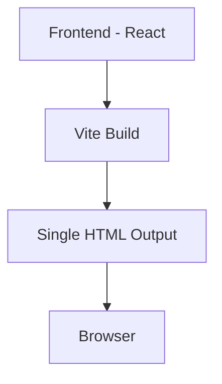

## 1. Architecture Design


## 2. Technology Description
- **Frontend**: React@18 + TypeScript + TailwindCSS@3 + Vite@6
- **Initialization Tool**: vite-init (react-ts template)
- **Backend**: None (纯前端展示页面)
- **Animation**: CSS @keyframes + Framer Motion (可选)

## 3. Route Definitions
| Route | Purpose |
|-------|---------|
| / | 展示首页，完整产品介绍 |

## 4. Component Structure
```
src/
├── components/
│   ├── Hero.tsx          # 星空首页
│   ├── Problem.tsx       # 问题陈述
│   ├── Flow.tsx          # 产品流程（含手机Mockup）
│   ├── StarsConcept.tsx  # 星空纪念
│   ├── Tech.tsx          # 技术方案
│   ├── Team.tsx          # 团队介绍
│   └── Footer.tsx        # 页脚
├── App.tsx               # 主应用
└── index.css             # 全局样式
```

## 5. Design Tokens
### Colors
- `--starry-dark`: #050A14
- `--starry-deep`: #0A1628
- `--starry-mid`: #0D1F3C
- `--starlight`: #D4A853
- `--starlight-bright`: #F4D06F
- `--starlight-glow`: #FFE49E
- `--letter-paper`: #F5E6C8
- `--paper-texture`: #FEFCF3
- `--envelope-red`: #C73E3A
- `--ink-black`: #1A1A1A
- `--ink-gray`: #5A5A5A
- `--ink-light`: #8A8A8A

### Fonts
- Family: Noto Serif SC
- Weights: 300, 400, 600, 700, 900

## 6. Animation Effects
- **Star Twinkle**: CSS @keyframes, 3s ease-in-out infinite
- **Scroll Reveal**: IntersectionObserver, translateY + opacity
- **Pulse Glow**: CSS @keyframes for brightest stars
- **Hover Effects**: transform + box-shadow transitions
